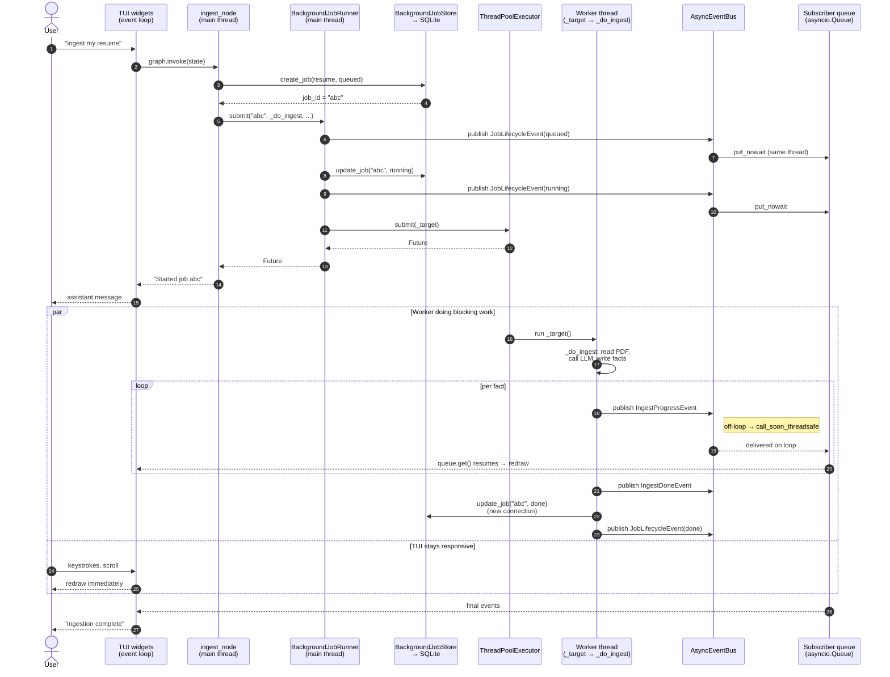

# Async in jobctl — a beginner's primer

A guide to how `async`/`await`, threads, and the event bus work together inside
jobctl. The goal is to give you the mental model needed to read and extend
`agent/graph.py`, `core/jobs/runner.py`, `core/jobs/store.py`, and
`core/events.py` without guessing.

## TL;DR

- **`async`/`await` is a cooperative scheduler inside a single thread.** It
  does not create threads, does not make calls non-blocking, and does not
  give you parallelism. It only lets one thread juggle many coroutines by
  yielding at `await` points.
- **Threads are how jobctl gets actual concurrency.** The TUI runs on the
  asyncio event loop; long/blocking work (LLM HTTP, SQLite, PDF parsing)
  runs on a `ThreadPoolExecutor` owned by `BackgroundJobRunner`.
- **The GIL does not hurt us here.** It is released during I/O, SQLite, and
  most C extensions — which is exactly what the worker threads spend their
  time on.
- **`AsyncEventBus` is the bridge** between worker threads and the event
  loop. Workers publish typed events; subscribers are `asyncio.Queue`s on
  the loop; `call_soon_threadsafe` makes cross-thread delivery safe.
- **Persistence and reactivity are two separate pipelines.**
  - DB pipeline (`BackgroundJobStore` → SQLite `ingestion_jobs` rows): survives
    restarts, used for recovery and history.
  - Bus pipeline (`AsyncEventBus` → `asyncio.Queue` subscribers): live UI
    updates, never touches SQLite.

## The root misconception to unlearn

Most confusion comes from treating `async` as if it means "non-blocking /
runs concurrently" and plain functions as if they mean "blocks everything."
Neither is right. Pin these four definitions:

- **Blocking vs non-blocking** is about the **OS thread**. A thread is
  "blocked" when it is stuck waiting and not executing Python. A network
  read, `time.sleep()`, a SQLite query — all block the *thread* that called
  them.
- **`async` / `await`** is a **cooperative scheduler inside a single
  thread**. A coroutine keeps the thread until it hits `await`, at which
  point it yields so the event loop can run *another coroutine on the same
  thread*. It does not add threads and does not make sync calls magically
  non-blocking.
- **Threads** are how the OS gives you things actually running at the same
  time (or at least waiting on multiple blocking calls at once).
- **The GIL** only matters for pure-Python CPU-bound work. It is released
  during I/O, SQLite, subprocess, `requests`/`httpx` sync, sockets, file I/O,
  and most C extensions.

A chef analogy for async alone:

- **Sync:** finish dish 1 completely, then start dish 2. If dish 1 needs to
  simmer 20 minutes, the chef stands and stares at it.
- **Async:** start dish 1 simmering, chop veg for dish 2 while it simmers,
  check the oven for dish 3, etc. One chef (thread), many dishes (tasks).

Threads give you *more chefs*. Async is one chef being smart about when to
switch between pots.

## When to reach for what

| Tool | What it gives you | Cost | Use when |
|---|---|---|---|
| **`async`/`await` (one thread)** | Many coroutines share one thread by yielding at `await`. No parallelism. | Needs async-native libraries. Any blocking call freezes *everything*. | Pure I/O waits with async-native stack (async HTTP, async DB). Classic: a web server serving 10k sockets. |
| **Threads (`ThreadPoolExecutor`, `threading`)** | Multiple OS threads. While one waits on I/O, others run. | Shared memory → need care with mutable state. SQLite connections not shareable across threads. | You must call **blocking** sync code (`sqlite3`, sync LLM SDKs, `requests`). This is jobctl's case. |
| **Processes (`ProcessPoolExecutor`, `multiprocessing`)** | Separate Python processes → true CPU parallelism, no shared GIL. | IPC overhead, data must be picklable, bigger memory footprint. | **CPU-bound** pure-Python work. |

Decision tree:

1. Bottleneck waiting on I/O? → async (if stack is async) or threads (if
   stack is sync).
2. Bottleneck pure Python CPU? → processes.
3. Bottleneck C/NumPy/SQLite/HTTP? → threads are fine; the GIL is released.

jobctl's long work is LLM HTTP + SQLite writes + light parsing — all GIL-
releasing — so `BackgroundJobRunner` uses a `ThreadPoolExecutor`.

## The key pieces in jobctl

### `AsyncEventBus` (`src/jobctl/core/events.py`)

Fan-out in-memory pub/sub:

- `subscribe() → asyncio.Queue` — each subscriber (a TUI widget) gets its own
  queue.
- `publish(event)` — puts a copy of the event into every subscriber's queue.
- Thread-safe publish: if called off the loop, uses
  `loop.call_soon_threadsafe` to schedule delivery on the loop.

Events are tiny frozen dataclasses like `IngestProgressEvent(source="resume",
current=12, total=42, ...)`. The bus has no idea what they mean. Meaning
lives at the producer (who builds them) and the consumer (who interprets
them).

### `BackgroundJobRunner` (`src/jobctl/core/jobs/runner.py`)

Owns a `ThreadPoolExecutor(max_workers=2)` plus a reference to the bus and
the store. Its job: run arbitrary sync functions on worker threads, publish
lifecycle events, and persist job state.

Key method `submit(job_id, fn, ...)`:

1. Publish `JobLifecycleEvent(queued)` on the bus (in-memory).
2. Write `state='running'` into SQLite via `store.update_job` (on disk).
3. Publish `JobLifecycleEvent(running)`.
4. Wrap `fn` in a `_target` closure (lifecycle bookkeeping).
5. Hand `_target` to the executor → a worker thread picks it up.
6. Return a `Future` immediately. Submit is **not** `async` because there is
   nothing to await — it is all microseconds of synchronous work.

### `BackgroundJobStore` (`src/jobctl/core/jobs/store.py`)

Thin wrapper around `sqlite3.Connection` for the `ingestion_jobs` and
`ingested_items` tables. Methods like `create_job`, `update_job`, `get_job`.
Uses `with self._conn:` blocks so each call is an auto-committed transaction.

### `_target` (inside `BackgroundJobRunner.submit`)

The wrapper that actually runs on a worker thread. It:

- Calls `fn(*args, **kwargs)`. If the result is a coroutine (i.e. someone
  passed an `async def`), runs it to completion via `asyncio.run` — a
  throwaway event loop just for the worker thread:

  ```python
  result = fn(*args, **kwargs)
  if inspect.iscoroutine(result):
      result = asyncio.run(result)
  ```

- On success → updates SQLite to `state='done'`, publishes
  `JobLifecycleEvent(done)`.
- On exception → updates SQLite to `state='failed'` with the traceback,
  publishes `JobLifecycleEvent(error)` plus a domain event
  (`IngestErrorEvent` or `ApplyProgressEvent(step="error")`).

So `fn` (e.g. `_do_ingest` in `ingest_node.py`) is the *real work*; `_target`
is the *bookkeeping wrapper* the runner adds around it.

### Subscribers (e.g. `src/jobctl/tui/widgets/progress_panel.py`)

A subscriber is just **(an `asyncio.Queue` + a coroutine that drains it)**.
Example shape:

```python
def on_mount(self) -> None:
    self._queue = self._bus.subscribe()
    self._pump_task = self.run_worker(self._pump(), exclusive=False)

async def _pump(self) -> None:
    while True:
        event = await self._queue.get()
        self._apply_event(event)
```

`await self._queue.get()` suspends until an event lands, then wakes up and
updates the widget. Multiple widgets can each `subscribe()` independently;
every one gets a copy of every event.

## Blocking vs the loop: the fine print

Three commonly-asked questions, settled:

- **"If `submit` runs on the main thread, won't it block the loop?"** Briefly,
  yes — during those microseconds no coroutines can run. But all it does is
  one SQLite `UPDATE` and two in-memory `publish` calls, so nobody notices.
  The *long* work is `_target`, which runs on a different thread entirely.
- **"Doesn't the GIL serialize the worker thread with the main thread?"**
  Only for pure-Python bytecode. SQLite, HTTP, file reads, subprocess, and C
  extensions release the GIL. While the worker is inside
  `conn.execute(...)`, the main thread holds the GIL and the loop ticks.
  They *alternate* on the GIL but the I/O genuinely overlaps.
- **"If `submit` isn't `async`, can any coroutines run during it?"** Not on
  the main thread — it holds the thread like any other plain call would.
  This is true for any function, async or sync: async only yields control at
  `await`. On the worker thread there is no loop by default, so "tasks" are
  not a concern — one `_target` runs at a time; a second concurrent job
  requires a second worker.

## Concrete walkthrough: ingesting a resume

The user types "ingest my resume" in the TUI. Here's the complete flow with
the actual jobctl pieces.

### Setup (happens once at app start)

- TUI instantiates an `AsyncEventBus` and calls `bus.attach_loop(loop)` so
  the bus knows which loop to marshal cross-thread deliveries onto.
- TUI creates a `BackgroundJobStore` (wrapping a SQLite connection) and a
  `BackgroundJobRunner(store, bus, max_workers=2)`.
- Every widget that wants live updates calls `bus.subscribe()` and spawns a
  `_pump()` coroutine.

### Main-thread phase — inside `ingest_node.start_resume_ingest`

1. **Insert job row.** `store.create_job(source_type="resume", ...)` runs
   `INSERT INTO ingestion_jobs (... state='queued' ...)` and returns
   `job_id = "abc"`. Row is on disk.
2. **Define `_do_ingest`.** A closure capturing `bus`, `conn`, `provider`,
   `resume_path`, etc. Nothing runs yet.
3. **Call `runner.submit("abc", _do_ingest, ...)`.** Inside `submit`:
   1. `_publish_lifecycle(phase="queued")` → bus → delivered synchronously to
      every subscriber queue (we are on the loop thread).
   2. `store.update_job("abc", state="running")` →
      `UPDATE ingestion_jobs SET state='running', updated_at=? WHERE id=?`.
      Tiny blocking call; committed.
   3. `_publish_lifecycle(phase="running")` → bus → subscribers.
   4. Build the `_target` closure.
   5. `self._executor.submit(_target)` → `_target` goes onto the executor's
      internal queue; an idle worker thread picks it up. Returns a `Future`
      immediately.
   6. Track the future; add a done-callback to clean it up; return.
4. Back in `ingest_node`, append an assistant message
   ("Started resume ingestion (job abc)."), publish an `AgentDoneEvent`, and
   return from the node. Control returns to LangGraph → back to the TUI loop.
   The user sees the confirmation almost instantly.

### Worker-thread phase — `_target()` on a pool thread

5. Worker calls `fn(*args, **kwargs)` = `_do_ingest()`.
6. `_do_ingest` opens **its own SQLite connection** (`sqlite3.Connection`s
   are not safe to share across threads). WAL mode (set in
   `db/connection.py`) lets the worker's connection write concurrently with
   the main thread's reads.
7. It reads the PDF, calls the LLM via the provider shim (blocking HTTP —
   GIL released during the network wait), and loops through extracted facts.
8. For each fact: embed, insert into SQLite, `bus.publish(IngestProgressEvent(
   current=12, total=42, ...))`.
   - Inside `publish`, `asyncio.get_running_loop()` raises on the worker
     thread → the bus takes the `call_soon_threadsafe` branch, scheduling
     `_deliver(event)` on the main loop.
   - On the next loop tick, `_deliver` `put_nowait`s the event into every
     subscriber's queue.
   - Any widget parked on `await self._queue.get()` wakes up and redraws.
9. When `_do_ingest` finishes, it publishes `IngestDoneEvent(facts_added=42)`.
10. Back in `_target`:
    - On success → `_update_job("abc", state="done")` (opens a fresh
      connection on the worker thread) →
      `UPDATE ingestion_jobs SET state='done', completed_at=?, updated_at=?`.
      Then `_publish_lifecycle(phase="done")` → bus.
    - On exception → `_update_job("abc", state="failed", error=traceback)`
      plus `_publish_lifecycle(phase="error")` plus an `IngestErrorEvent`.
      The loop *never* sees the exception directly; it is caught in
      `_target`.
11. Worker thread returns to the pool, ready for the next job.

### SQLite writes vs bus events, side by side

| Step | Thread | SQL statement | Bus event |
|---|---|---|---|
| 1 (create) | main | `INSERT ... state='queued'` | — |
| 3.i | main | — | `JobLifecycleEvent(queued)` |
| 3.ii | main | `UPDATE ... state='running'` | — |
| 3.iii | main | — | `JobLifecycleEvent(running)` |
| 8 (loop) | worker | per-fact `INSERT`s via graph store | `IngestProgressEvent` × N |
| 9 | worker | — | `IngestDoneEvent` |
| 10 ok | worker | `UPDATE ... state='done', completed_at=?` | `JobLifecycleEvent(done)` |
| 10 err | worker | `UPDATE ... state='failed', error=?, completed_at=?` | `JobLifecycleEvent(error)` + `IngestErrorEvent` |

The two columns describe the same lifecycle in two different media. SQLite
is persistent state (surviving restarts, powering "list my past jobs"). The
bus is live reactivity (powering the progress bar updating in real time).

## End-to-end sequence diagram



The two parallel lanes are the whole point: the worker thread crunches
through SQLite writes and HTTP calls while the event loop keeps servicing
the user. The bus is the only sanctioned channel between them.

## Vocabulary cheat-sheet

| Term | One-liner |
|---|---|
| `async def` | Defines a coroutine — a pausable function. Calling it returns a recipe; it doesn't run until awaited. |
| `await x` | "Pause me until `x` is ready; let the loop run others meanwhile." |
| Event loop | The single-threaded scheduler that swaps between awaiting coroutines. |
| Coroutine vs Task | Coroutine = recipe; Task = a coroutine the loop is actively running. |
| `asyncio.Queue` | A FIFO that producers `put` to and consumers `await get()` on. |
| `ThreadPoolExecutor` | Pool of OS threads for running blocking/sync work off the loop. |
| GIL | Only one thread executes Python bytecode at a time; released during I/O and most C extensions. |
| `call_soon_threadsafe` | The bridge: "from this other thread, please run X on the loop." |
| `asyncio.run(coro)` | Create a temporary event loop on the current thread, run `coro` to completion, tear loop down. |
| Event | In jobctl, a frozen dataclass like `IngestProgressEvent` broadcast via the bus. |
| Subscriber | An `asyncio.Queue` + a coroutine looping `await queue.get()`. |
| `_target` | Runner's inner closure that wraps the user's `fn` with lifecycle + error bookkeeping; runs on a worker thread. |
| `fn` | The actual work (e.g. `_do_ingest`); plain sync function that the runner executes on a worker thread. |

If you remember just one thing: **`await` = "I'm idle, do something else."**
Everything else — `BackgroundJobRunner`, `ThreadPoolExecutor`,
`AsyncEventBus`, subscriber queues, `call_soon_threadsafe` — is plumbing
built around that idea so the TUI never freezes while long, blocking work
runs in the background.
