# jobctl TUI UX Flow Assessment

This document maps the current user-facing TUI flows and records UX issues found while tracing the implementation. It reflects the code in `src/jobctl/tui`, `src/jobctl/agent`, and the apply/ingestion pipelines as of this review.

## Mermaid Flow

```mermaid
flowchart TD
    Start["Run `jobctl`"] --> Load["Load project config, DB, provider"]
    Load --> Shell["JobctlApp shell"]
    Shell --> Chat["Chat view"]

    Shell --> GlobalNav["Global navigation"]
    GlobalNav -->|"Ctrl-J / F1 / g c"| Chat
    GlobalNav -->|"Ctrl-G / F2 / g g"| Graph["Graph view"]
    GlobalNav -->|"Ctrl-T / F3 / g t"| Tracker["Tracker view"]
    GlobalNav -->|"Ctrl-R / F4 / g a"| Apply["Apply view"]
    GlobalNav -->|"Ctrl-E / F5 / g u"| Curate["Curate view"]
    GlobalNav -->|"Ctrl-S / F6 / g ,"| Settings["Settings view"]
    GlobalNav -->|"Ctrl-P / :"| Palette["Command palette"]
    GlobalNav -->|"?"| Help["Keybinding help"]
    GlobalNav -->|"Ctrl-B"| Sidebar["Background jobs sidebar"]
    GlobalNav -->|"Ctrl-Q"| Quit{"Active jobs?"}
    Quit -->|"No"| Exit["Exit app"]
    Quit -->|"Yes"| QuitConfirm["Quit confirmation"]
    QuitConfirm -->|"y"| Exit
    QuitConfirm -->|"n / Esc"| Shell

    Palette -->|"View command"| GlobalNav
    Palette -->|"Slash command"| Chat
    Help -->|"Esc / q"| Shell

    Chat -->|"Plain message"| Agent["LangGraph runner"]
    Agent --> Router{"Router"}
    Router -->|"default"| ChatNode["chat_node: stream LLM reply"]
    Router -->|"/apply"| ApplyNode["apply_node: start background apply"]
    Router -->|"/ingest"| IngestNode["ingest_node: start background ingest"]
    Router -->|"/curate"| CurateNode["curate_node: generate proposals"]
    Router -->|"mode != chat"| ModeNode["mode-specific node"]
    ChatNode -->|"AgentTokenEvent / AgentDoneEvent"| Chat
    ChatNode -->|"resume keyword"| ResumePrompt["Inline file picker prompt"]
    ChatNode -->|"GitHub keyword"| GithubPrompt["Inline confirmation prompt"]
    ResumePrompt -->|"path selected"| ConfirmAnswer["ConfirmationAnsweredEvent"]
    GithubPrompt -->|"yes/no"| ConfirmAnswer
    ConfirmAnswer -. "currently no follow-up action" .-> Chat

    ApplyNode --> ApplyJob["run_apply background job"]
    ApplyJob -->|"fetch JD"| ApplyProgress["ApplyProgressEvent"]
    ApplyJob -->|"retrieve graph context"| ApplyProgress
    ApplyJob -->|"evaluate fit"| ApplyProgress
    ApplyJob -->|"needs user choice"| InlineConfirm["Inline yes/no card"]
    InlineConfirm -->|"answer"| ApplyJob
    ApplyJob -->|"create tracker entry / render materials"| Tracker
    ApplyProgress --> Sidebar
    ApplyProgress --> Apply

    IngestNode --> ResumeIngest["Resume ingest job"]
    IngestNode --> GithubIngest["GitHub ingest job"]
    ResumeIngest -->|"facts persisted"| Graph
    GithubIngest -->|"facts persisted"| Graph
    ResumeIngest -->|"IngestProgress/Done/Error"| Sidebar
    GithubIngest -->|"IngestProgress/Done/Error"| Sidebar

    Graph -->|"Search input"| GraphRefresh["Filter tree"]
    Graph -->|"Enter"| GraphDetail["Show selected node detail"]
    Graph -->|"e"| GraphEdit["Edit selected node YAML"]
    GraphEdit -->|"blur editor"| GraphSave["Update node and re-embed"]
    Graph -->|"a"| GraphAdd["Add note node"]
    Graph -->|"d"| GraphDelete["Delete selected node"]

    Tracker -->|"Select row / Enter"| TrackerDetail["Show application detail"]
    Tracker -->|"n"| Notes["Focus notes"]
    Notes -->|"blur"| SaveNotes["Save notes"]
    Tracker -->|"s"| StatusCycle["Cycle status"]
    Tracker -->|"a"| NewApp["New application modal"]
    NewApp -->|"Save"| Tracker
    Tracker -->|"o"| OpenPdf["Open recorded resume PDF"]

    Apply -->|"select application"| ApplyDetail["Show JD, evaluation, resume YAML"]
    Apply -->|"s"| SaveYaml["Save edited resume YAML"]
    Apply -->|"p / Render PDF"| RenderPdf["Render PDF in worker"]
    RenderPdf -->|"status only today"| Apply
    Apply -->|"o"| OpenApplyPdf["Open recorded resume PDF"]
    Apply -->|"c"| CoverQueued["Publish cover-letter queued event"]
    Apply -->|"r"| ApplyRefresh["Reload applications"]

    Curate -->|"c / Run curation"| CurateNode
    Curate -->|"Reload"| CurateReload["Load pending proposals"]
    CurateReload --> ProposalCards["Proposal cards grouped by kind"]
    ProposalCards -->|"Accept"| MarkAccepted["Mark proposal accepted"]
    ProposalCards -->|"Reject"| MarkRejected["Mark proposal rejected"]
    ProposalCards -->|"Edit"| EditProposal["Show JSON editor"]
    EditProposal -. "Save/Cancel currently unhandled" .-> Curate

    Settings -->|"read-only"| ConfigSummary["Config summary"]
```

## Issues And Fixes

### 1. `/graph` Slash Command Crashes The TUI

- **Severity:** High
- **Flow:** Chat view -> type `/graph`
- **What happens:** `ChatView._handle_slash_command()` calls `self.app.switch_screen("graph")`, but `JobctlApp` does not install Textual screens named `graph`; it uses a `ContentSwitcher` with child views. I verified this path with `run_test()`, and it raises `KeyError: "No screen called 'graph' installed"`.
- **Fix:** Replace `self.app.switch_screen("graph")` with the app's internal view-switch path, e.g. `self.app.action_show_graph()` or a public `show_view("graph")` method. Add a Textual pilot test for `/graph`.

### 2. Proactive Resume/GitHub Ingestion Prompts Are Dead Ends

- **Severity:** High
- **Flow:** Chat -> mention "resume" or "GitHub" -> inline prompt appears -> user answers/selects file
- **What happens:** `chat_node` publishes `ConfirmationRequestedEvent`, and `ChatView` renders `FilePicker` or `InlineConfirmCard`. The resulting `ConfirmationAnsweredEvent` is not tied to pending agent state or a follow-up action, so selecting a file or answering "yes" does not start ingestion.
- **Fix:** Choose one ownership model:
  - Agent-owned: set `state.pending_confirmation` with payload describing the next action, route to `wait_for_confirmation_node`, and translate the answer into `last_tool_result` for `ingest_node`.
  - UI-owned: handle `FilePicker.FileSelected` / `ConfirmationAnsweredEvent` in `ChatView` and submit a structured ingest request to the runner.
  GitHub should use a username/repo input or multi-select flow, not a plain yes/no card.

### 3. Palette Slash Commands Do Not Start The Promised Workflows

- **Severity:** Medium
- **Flow:** Command palette -> `Slash: /ingest resume` or `Slash: /ingest github`
- **What happens:** The palette dispatches raw text to Chat. The router sends `/ingest ...` to `ingest_node`, but `ingest_node` expects `state.last_tool_result.source_type/source_value`. With only a slash string, it falls back to "I can ingest either a resume file or GitHub repos. Which would you like?"
- **Fix:** Make palette workflow commands structured actions instead of raw slash strings:
  - `/ingest resume` should open the file picker or submit `{source_type: "resume", source_value: path}` after selection.
  - `/ingest github` should ask for a username/repo URL and then submit `{source_type: "github", source_value: [...]}`.
  - Keep raw slash forwarding only for commands that are actually text-driven.

### 4. Apply View Renders PDFs But Does Not Record The New PDF Path

- **Severity:** High
- **Flow:** Apply view -> select application with resume YAML -> Render PDF -> Open PDF
- **What happens:** `ApplyView.action_render_pdf()` renders a PDF and shows a status message, but it does not update `applications.resume_pdf_path` or refresh the selected `ApplicationRow`. Pressing Open PDF can still say "No PDF rendered yet" because the row's recorded path is unchanged.
- **Fix:** After render succeeds, update the application row with `update_application(conn, app_id, resume_pdf_path=pdf_path)`, refresh applications, and keep the same selection. Add a test for render -> open path availability.

### 5. Apply View "Generate Cover Letter" Is Only A Stub

- **Severity:** Medium
- **Flow:** Apply view -> Generate cover letter
- **What happens:** The button publishes `ApplyProgressEvent(step="generate_cover", message="queued")` but does not start cover-letter generation or update tracker paths.
- **Fix:** Either wire it to the same cover-letter generation pipeline used by `run_apply()` or disable/hide the button until implemented. The status should not say queued unless work is actually enqueued.

### 6. Curation Proposal Editing Cannot Be Saved Or Canceled

- **Severity:** High
- **Flow:** Curate view -> proposal card -> Edit -> Save/Cancel
- **What happens:** `CurationProposalCard.action_edit()` mounts a JSON editor with Save and Cancel buttons, but `on_button_pressed()` only handles `accept`, `reject`, and `edit`. Save/Cancel clicks do nothing.
- **Fix:** Handle `save` and `cancel` button IDs. Save should parse JSON, emit `Edited`, and remove/restore the editor. Cancel should discard the editor and show the original body again. Add a widget test.

### 7. Accepting Curation Proposals Only Marks Status

- **Severity:** Medium
- **Flow:** Curate view -> Accept merge/rephrase/connect/prune proposal
- **What happens:** `CurationProposalStore.accept()` only marks the proposal as accepted. It does not apply the merge, rephrase, new edge, or prune operation to the graph.
- **Fix:** Add proposal application logic by kind:
  - `merge`: combine nodes, move edges/sources, delete duplicate.
  - `rephrase`: update node `text_representation` and re-embed.
  - `connect`: create edge.
  - `prune`: delete/archive node.
  If "accept" is intended only as approval, rename the button to avoid implying the graph changed.

### 8. Curate `Ctrl-A` Binding Has No Action

- **Severity:** Low
- **Flow:** Curate view -> press `Ctrl-A`
- **What happens:** `CurateView.BINDINGS` includes `Binding("ctrl+a", "accept_group", ...)`, but there is no `action_accept_group()` implementation.
- **Fix:** Implement group focus tracking plus `action_accept_group()`, or remove the binding from the help surface.

### 9. Graph Search Escape Binding Is Likely Shadowed

- **Severity:** Low
- **Flow:** Graph view -> focus search -> type filter -> press Escape
- **What happens:** `GraphView` binds Escape to `clear_search`, but `JobctlApp` also binds Escape with `priority=True` to `blur_focus`. The global binding is likely to run first, so Escape defocuses instead of clearing search.
- **Fix:** Make global Escape context-aware: if the current view is Graph and the search has text, clear it; otherwise blur focus. Alternatively remove the Graph Escape binding and provide a visible Clear button.

### 10. Graph Delete Is Immediate And Easy To Trigger

- **Severity:** Medium
- **Flow:** Graph view -> select node -> press `d`
- **What happens:** The node is deleted immediately with no confirmation, and edge cascades apply.
- **Fix:** Add an inline or modal confirmation before deletion, including the node name and relationship count. Consider a soft-delete/undo event for destructive graph edits.

### 11. Graph Edit Requires A Prior Detail Selection

- **Severity:** Low
- **Flow:** Graph view -> move cursor to node -> press `e`
- **What happens:** `action_edit_selected()` only edits `current_node_id`, which is set by Enter or row selection logic. A user can have the tree cursor on a node but `e` does nothing if they have not pressed Enter first.
- **Fix:** In `action_edit_selected()` and `action_delete_selected()`, derive the current node from `tree.cursor_node.data` when available, then update `current_node_id`.

### 12. Apply Results Do Not Automatically Focus Or Refresh The Apply View

- **Severity:** Low
- **Flow:** Chat -> `/apply <JD>` -> background apply completes
- **What happens:** The tracker entry/materials are created, and progress events are published, but the user is not moved to Apply view and an already-mounted Apply view does not automatically reload its application list when the apply job finishes.
- **Fix:** On `ApplyProgressEvent(step="done")`, refresh `ApplyView`; optionally switch to Apply view or show a CTA in Chat/Sidebar: "Open application materials".

### 13. Tracker Notes Save Silently On Blur

- **Severity:** Low
- **Flow:** Tracker -> select row -> edit notes -> leave field
- **What happens:** Notes are saved on blur without visible status or error handling.
- **Fix:** Add a small "Saved" / "Save failed" status label and consider explicit `Ctrl-S` save for users who expect confirmation.

## Suggested Implementation Order

1. Fix hard breakages: `/graph` crash, Apply render path persistence, curation edit Save/Cancel.
2. Make ingest prompts and palette actions structured, so Chat, Palette, and Agent share the same workflow contract.
3. Apply curation proposal effects to the graph or rename "Accept" semantics.
4. Add pilot/widget tests for each repaired UX path.
5. Tighten destructive/edit flows: Graph delete confirmation, Graph edit from cursor, visible Tracker save status.
