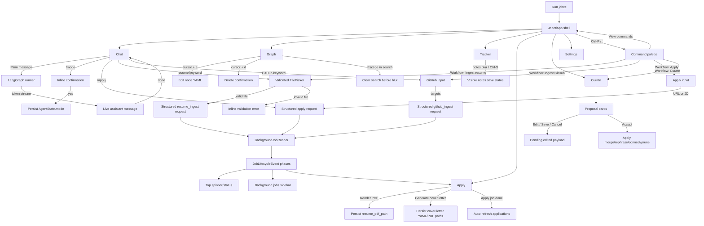

# jobctl TUI UX Flow Assessment

This document reflects the current seamless TUI milestone behavior. Earlier dead-end or misleading paths from the v3.0 assessment have been fixed and are listed in the resolved section.

## Current Flow

## Resolved Issues

- Chat slash navigation now uses `JobctlApp.show_view(...)`; `/graph`, `/tracker`, `/curate`, and `/settings` switch ContentSwitcher views without Textual screen errors.
- Palette view commands switch views directly. Palette workflow commands collect required input instead of sending raw slash text.
- Chat streaming renders one live assistant message and finalizes it once.
- Resume ingestion prompts open a validated file picker. Empty paths, directories, missing files, and unsupported extensions show inline errors.
- GitHub ingestion prompts open an input widget for usernames, profile URLs, or repo URLs.
- Apply starts accept inline input from Chat and palette, and `/apply <url-or-text>` submits directly.
- `/mode <name>` uses confirmation and persists `AgentState.mode`.
- Background jobs publish normalized lifecycle phases and render in the top spinner plus sidebar.
- Apply render persists `resume_pdf_path`; cover-letter generation produces durable tracker paths when prerequisites exist; Apply refreshes on apply completion.
- Curation proposal Save/Cancel work; accepted proposals apply graph effects.
- The broken Curate `Ctrl-A` binding was removed.
- Graph edit/delete operate on the tree cursor, delete requires confirmation, and Escape clears search before blur.
- Tracker notes show save success/failure and support explicit `Ctrl-S`.

## Residual UX Risks

- Curation rephrase updates node text but does not force vector re-embedding unless a provider-aware path is added to the proposal applier.
- Graph delete is confirmed but still permanent; there is no undo or archive policy yet.
- Apply auto-refresh selects the most recent application on job completion because lifecycle events do not yet carry the created `app_id`.
